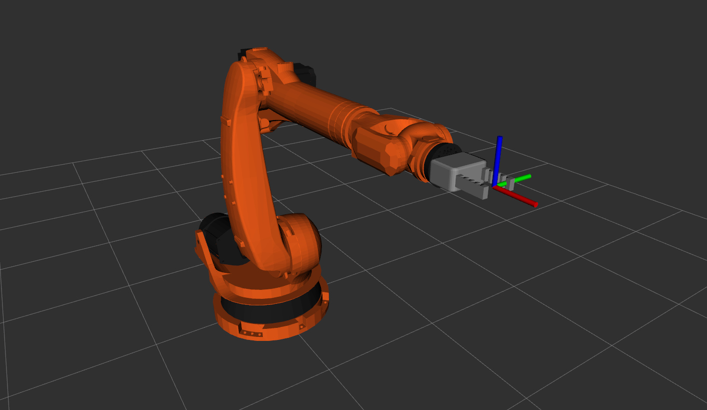
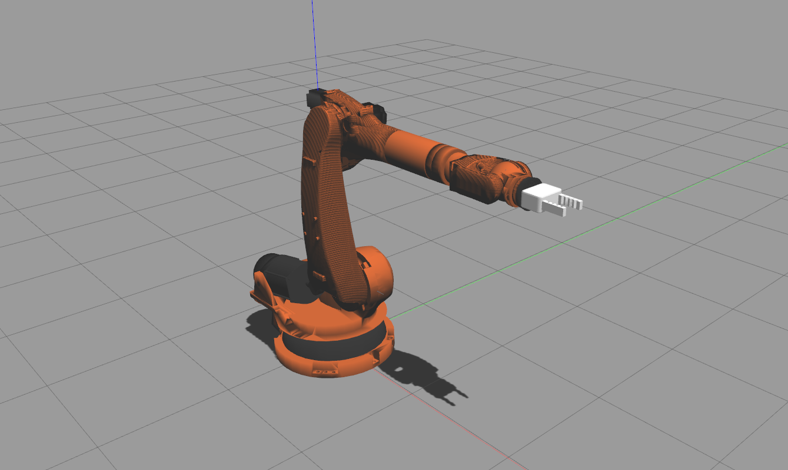

# Industrial Robot Simulation

This is industrial robot simulation in the gazebo environment.

*Author: Mehmet Kahraman / Date 26.06.2024*

Main Requirements:
--
- Ubuntu 20.04 Focal
- ROS 1 Noetic Desktop Full

Required ROS Packages:
--
```
sudo apt install ros-noetic-moveit
sudo apt install ros-noetic-moveit-commander
sudo apt install ros-noetic-moveit-core*
sudo apt install ros-noetic-moveit-msgs

sudo apt install ros-noetic-gazebo-ros*
sudo apt install ros-noetic-gazebo-dev
sudo apt install ros-noetic-gazebo-plugins
sudo apt install ros-noetic-gazebo-msgs

sudo apt install ros-noetic-robot-controllers*
sudo apt install ros-noetic-robot-state*
sudo apt install ros-noetic-joint*
sudo apt install ros-noetic-control*
sudo apt install ros-noetic-trajectory*
sudo apt install ros-noetic-transmission*
```

Running Simulation:
--

To display the robot on Rviz:
```
roslaunch robot_description display_robot.launch
```


To launch gazebo and spawn the robot with Moveit:
```
roslaunch robot_gazebo bringup_robot.launch rviz:=true
```


